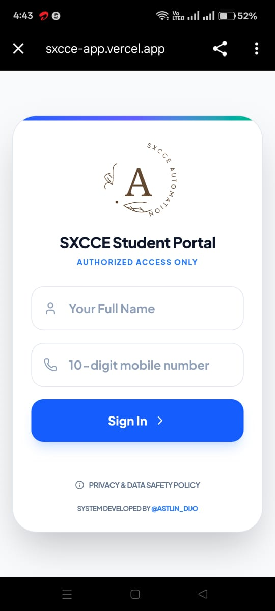
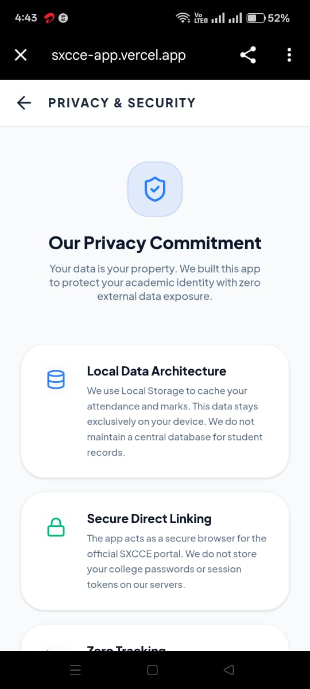
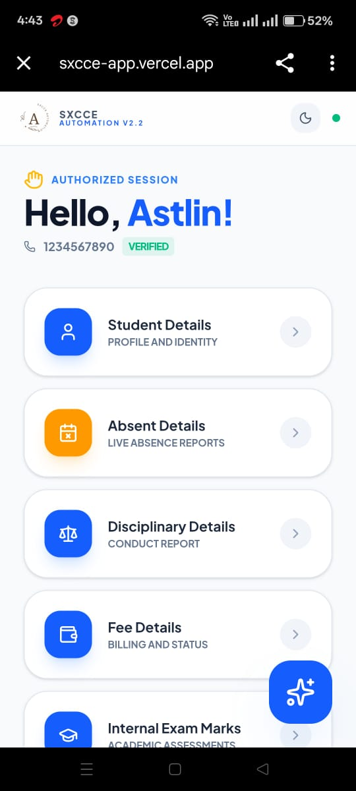
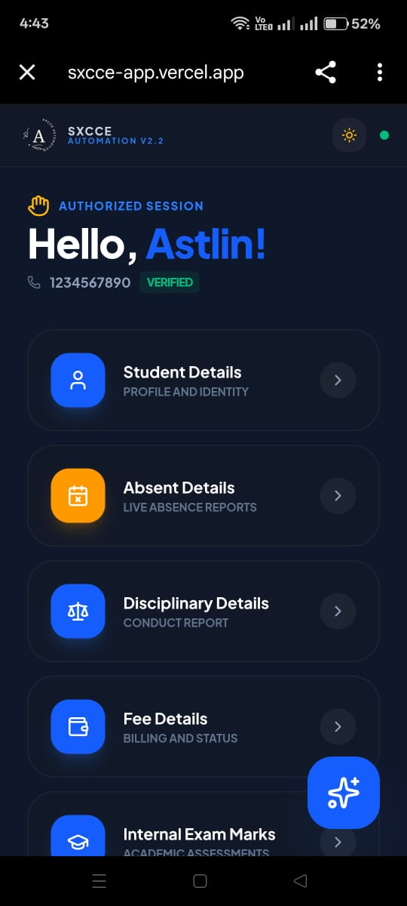
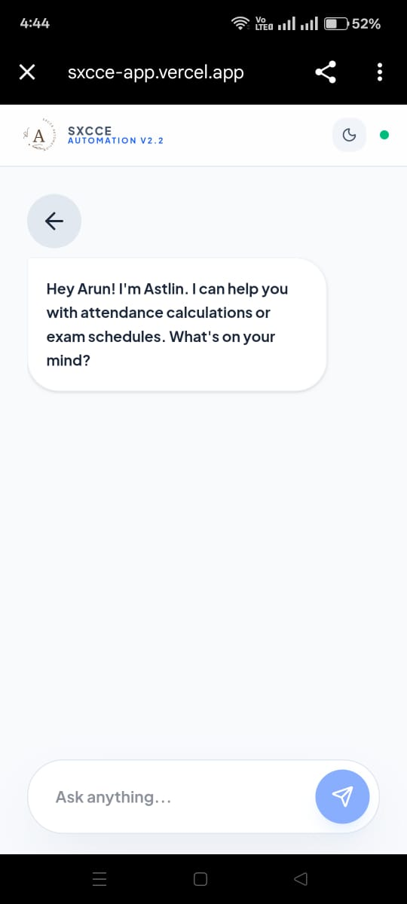
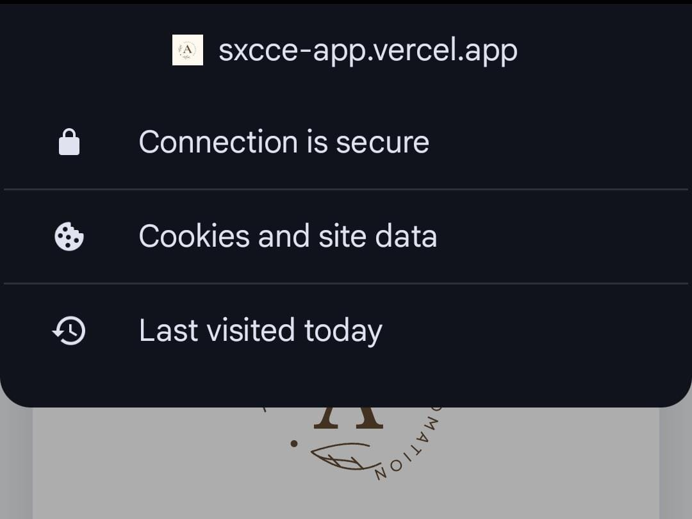

# SXCCE Automation - Student Portal

A modern, secure, and SEO-optimized Next.js student portal for SXCCE. Access student details, attendance, fees, exam marks, and more.

## Sxcce Automation App

## Live Demo

Only Below is I owned Sites

✅ [sxcce.engineer](https://sxcce.engineer)

✅ [sxcce.dev](https://sxcce.dev)

✅ [sxcce-automation.vercel.app](https://sxcce-automation.vercel.app)

✅ [astlin-dijo.tech](https://astlin-dijo.tech)

## Images

| Image 1 | Image 2 | Image 3 |
|---------|---------|---------|
|  |  |  |

| Image 4 | Image 5 | Image 6 |
|---------|---------|---------|
|  |  |  |

## Features

- ✅ **Student Portal**: Login with phone number or Roll number to access student information
- ✅ **Multiple Services**: Access student details, attendance, fees, exam marks, and disciplinary records
- ✅ **Security**: Comprehensive security headers and best practices
- ✅ **SEO Optimized**: Meta tags, sitemap, robots.txt for Google indexing
- ✅ **Modern UI**: Beautiful, responsive design with smooth animations
- ✅ **TypeScript**: Full type safety
- ✅ **Performance**: Optimized for speed and Core Web Vitals
- ✅ **Gate Keeper**: (Middleware)

## Portal Features

- **Student Details**: View student information
- **Absent Details**: Check attendance records
- **Disciplinary Details**: View disciplinary records
- **Fee Details**: Access fee information
- **Internal Exam Marks**: View internal exam results
- **End-Sem Exam Results**: Check end-semester exam results

## Usage

1. Enter your 10-digit mobile number or roll number on the login page
2. Click "Login" to access the student portal
3. Select any service from the menu
4. Use the back button to return to the menu
5. Click "Log Out" to logout

## Security Features

- Strict Transport Security (HSTS)
- XSS Protection
- Content Security Policy 
- Frame Options
- Content Type Options
- Referrer Policy
- Permissions Policy
- HMAC-based session tokens (tamper-proof)
- **Rate Limiting**: IP-based rate limiting (30 requests/min for normal traffic, 10 for bots)
- **Bot Protection**: Automatic detection and blocking of malicious bots and scrapers
- **DDoS Protection**: Automatic IP blocking after repeated violations
- No index For Attendence Calculation page in SEO
## Password Protection
[**Video Tutorial**](https://www.linkedin.com/posts/astlin-dijo_webdevelopment-cybersecurity-authentication-ugcPost-7434686801879056384-dMTD?utm_source=share&utm_medium=member_desktop&rcm=ACoAAFlAdxoBdPgwuHrFJPlltus7_Ho-pjDQPTw)
### Features

- Multi-step single-page form — Instructions → Identity → OTP → Password → Success
- Email OTP verification — 6-digit OTP sent to yourname.rollno@sxcce.edu.in address, valid for 5 minutes, single-use
- After 5 Wrong Attempt OTP Expire.
- Roll-number cross-check — the number inside the email must match the roll number field
- Secure password storage — bcrypt (cost 10) hash stored in DataBase; plaintext never persisted
- OTP - bcrypt hash stored in DB ; Auto Erase After Session End.
- bcrypt compare used to Authenticate (Login)
- Password strength indicator — real-time feedback while typing
- Rate limiting — max 3 OTP requests per hour per email.
- noindex 
- **Rate Limiting**: IP-based rate limiting 
- **Bot Protection**: Automatic detection and blocking of malicious bots and scrapers
- **DDoS Protection**: Automatic IP blocking after repeated violations
- Change Password by Same OTP process
  

## 🛡️ Security & Maintenance Declaration

As the developer of this project, I am committed to maintaining code quality, security, and long-term stability.

- 🔧 Regularly update dependencies to their latest stable versions  
- 🚀 Fix reported vulnerabilities using `npm audit` and security patches  
- 📦 Monitor deprecated packages and migrate to supported alternatives  
- 🔍 Continuously review build logs and deployment logs  
- 🛡️ Follow best practices for secure coding and data protection  
- 📊 Monitor application performance and runtime errors  
- 🔄 Maintain version control and proper release management  

This project is actively maintained to ensure security, reliability, and performance.

## Created By

**Astlin Dijo** - [@astlin_dijo](https://www.google.com/search?q=Astlin+Dijo)

## License

© 2026 Astlin Dijo. All rights reserved.

